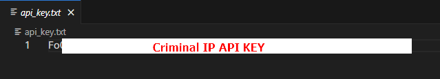
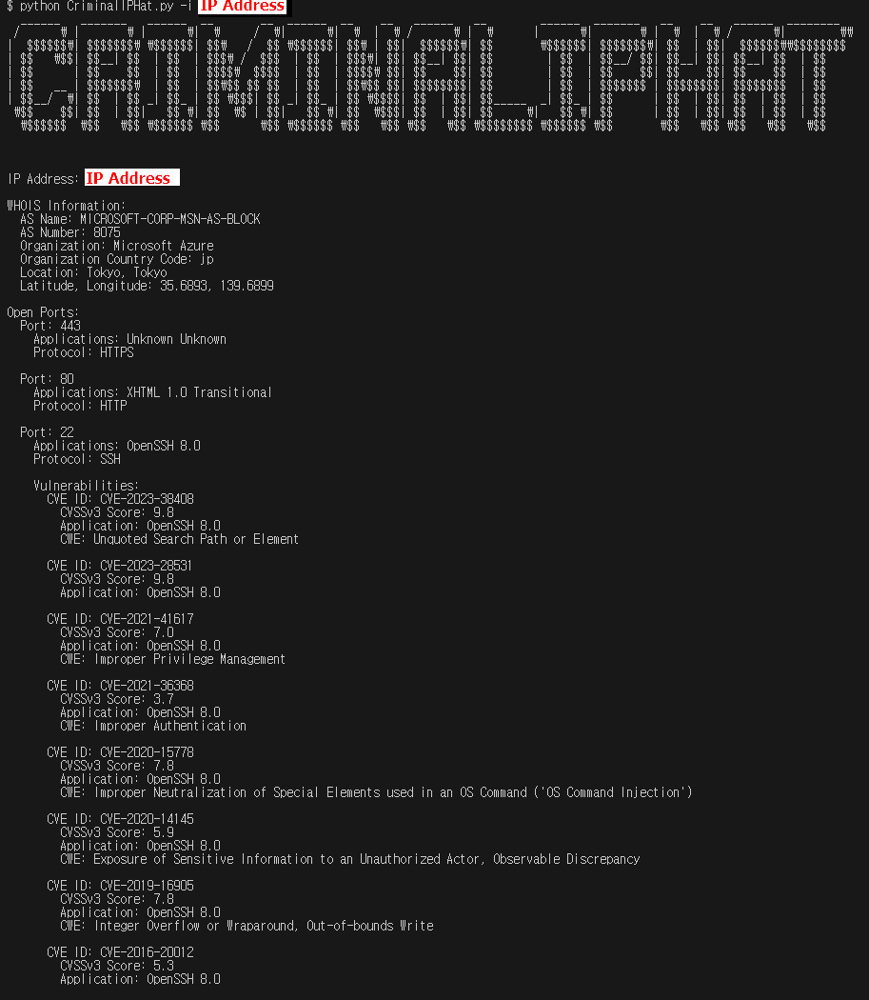

# CriminalIPHat
 
**CriminalIPHat** is a tool that allows you to retrieve security and network information for a queried IP address using the CriminalIP API. It provides details such as IP Whois information, open ports, and vulnerability data.
 
## Prerequisites
 
- **CriminalIP API Key**: You need to have a valid API key from [criminalip.io](https://www.criminalip.io).
 
## Installation
 
1. Install the required Python package:
 
    ```bash
    $ pip install requests
    ```
 
2. Clone the repository:
 
    ```bash
    $ git clone https://github.com/user_name/CriminalIPHat.git
    ```
 
## Adding API Key
 
- Enter your CriminalIP API Key in the `api_key.txt` file.

 
### Query information for a specific IP address:
 
```bash
CriminalIPHat$ CriminalIPHat -i IP Address
```
 
## Command Options
 
| **Command Option** | **Description** | **Example** |
|--------------------|-----------------|-------------|
| `-i` | Used to query information for a specific host's (server or computer) IP address. | `python3 CriminalIPHat.py -i 8.8.8.8` |
| `-l` | Used to query information for multiple IP addresses at once. | `python3 CriminalIPHat.py -l ip_list.txt` |
| `--setkey` | Automatically sets the API key. | `python3 CriminalIPHat.py --setkey YOUR_API_KEY` |
| `-r` | Scans a specific IP range and retrieves information for each IP. Enter the IP range in the format `StartIP-EndIP`. | `python3 CriminalIPHat.py -r 192.168.1.1-192.168.1.255` |
| `-o` | Saves the query results to a file. | `python3 CriminalIPHat.py -i 8.8.8.8 -o result.txt` |
 
 
## Examples

